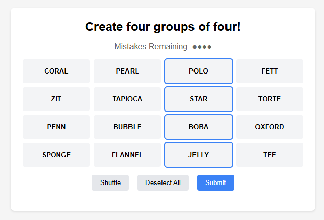

# Web Connections Game 🎮

A web-based implementation of the popular NYT Connections word puzzle game. Challenge yourself to find relationships between words and improve your associative thinking skills with this engaging puzzle game.



## 🎯 Live Demo
Experience the Connections game firsthand:
[Play Connections Game Online](https://ConnectionsHint.tips)

## What is Connections? 🤔

Connections is an addictive word puzzle game inspired by the New York Times' popular daily puzzle. In this game, players face 16 words that need to be organized into four distinct groups of four, with each group sharing a common theme or connection.

The Connections puzzle features a color-coded difficulty system:
- 🟨 Yellow (Easiest): Generally straightforward connections (e.g., colors, animals)
- 🟩 Green (Easy-Medium): Common phrases or related concepts
- 🟦 Blue (Medium-Hard): Requires deeper thinking and wordplay
- 🟪 Purple (Hardest): Most challenging connections, often involving complex wordplay or obscure references

Each Connections puzzle challenges players to identify these hidden relationships while managing their limited attempts. The game has gained massive popularity for its perfect blend of vocabulary knowledge, lateral thinking, and puzzle-solving skills.

## ✨ Features

Our web implementation of Connections includes:
- Clean, intuitive interface matching the original NYT Connections style
- Responsive design for both desktop and mobile play
- Real-time feedback on selections and solutions
- Progress tracking with remaining attempts
- Interactive word selection and grouping
- Color-coded difficulty indicators
- Custom word group creation capability
- Shuffle feature for different word arrangements

Technical Features:
- Pure HTML/CSS/JavaScript implementation
- No framework dependencies
- Easy to deploy and customize
- Lightweight and fast-loading
- Mobile-responsive design
- Accessible keyboard controls

## 🎮 How to Play

1. **Basic Gameplay**:
   - Select four words that you think share a connection
   - Submit your selection to verify
   - Correct groups will be revealed and color-coded
   - You have four attempts to find all connections

2. **Controls**:
   - Click/tap words to select them
   - Use the "Submit" button to check your answer
   - "Shuffle" button reorganizes words
   - "Deselect All" clears your current selection

3. **Strategy Guide**:
   - Start with the most obvious connections (Yellow group)
   - Look for common themes, categories, or word patterns
   - Consider multiple meanings of words
   - Pay attention to revealed groupings for hints

## 🎯 Connections Hints and Tips

Success in Connections relies on recognizing various types of word relationships:

Common Pattern Types:
- Words that can follow/precede a common word
- Members of a category (e.g., sports, foods)
- Synonyms or related concepts
- Parts of common phrases
- Words with similar patterns or structures

Strategy Tips:
- Begin with the most obvious connections
- Look for word patterns and commonalities
- Consider multiple word meanings
- Use process of elimination
- Learn from incorrect attempts

## 🚀 Installation

Quick Start:
```bash
# Clone the repository

# Navigate to project directory
cd connections-game

# Open in browser
open index.html
```

Requirements:
- Modern web browser
- No additional dependencies needed

Deployment Options:
- Direct hosting of static files
- GitHub Pages deployment
- Any static file hosting service

For custom word groups, modify the `gameData` object in the JavaScript code:
```javascript
const gameData = {
  groups: [
    {
      id: 1,
      color: "bg-yellow-200",
      words: ["WORD1", "WORD2", "WORD3", "WORD4"]
    }
    // Add more groups...
  ]
};
```

This implementation of Connections brings the engaging word puzzle to the web, making it accessible for players to enjoy and practice their word association skills. Whether you're a casual player or a dedicated puzzle enthusiast, our version of Connections offers an authentic experience with the flexibility to create and share custom puzzles.
